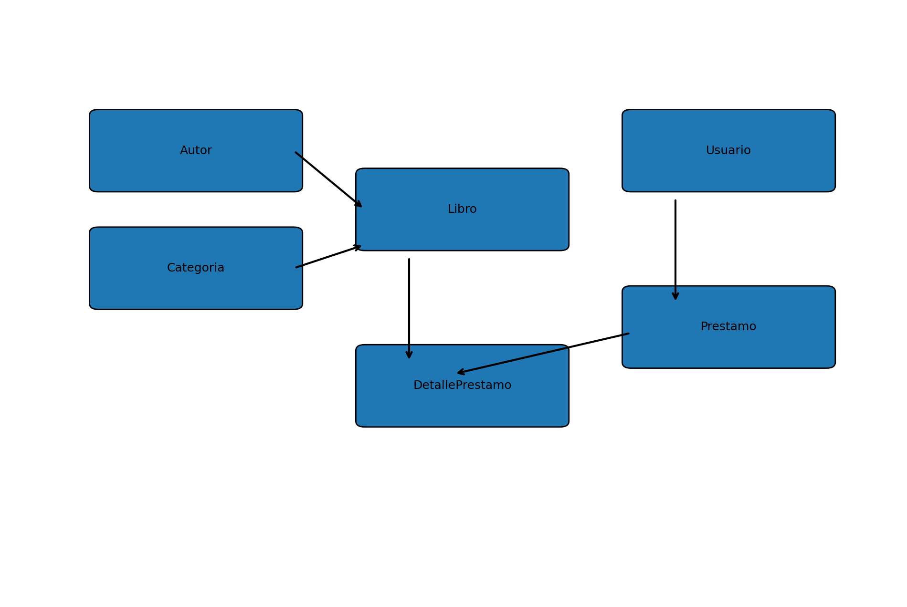

# API Biblioteca

Proyecto desarrollado con Django REST Framework y MySQL para la gestión de una biblioteca.

## Diagrama de Modelos



## Instrucciones para levantar la Base de Datos con Docker

1. Asegúrate de tener Docker instalado.

2. Levanta el contenedor de MySQL:

```bash
docker compose up -d
```

3. Verifica que el contenedor esté ejecutándose:

```bash
docker ps
```

4. Activa el entorno virtual:

```bash
lab\Scripts\activate
```

5. Instala las dependencias del proyecto:

```bash
pip install -r requirements.txt
```

6. Aplica las migraciones:

```bash
python manage.py migrate
```

7. Inicia el servidor de Django:

```bash
python manage.py runserver
```

## Documentación Swagger

La documentación de la API se encuentra disponible en:

```
http://127.0.0.1:8000/swagger/
```

## Endpoints principales

- `/api-jean-v1/Autor/`
- `/api-jean-v1/Categoria/`
- `/api-jean-v1/Libro/`
- `/api-jean-v1/Usuario/`
- `/api-jean-v1/Prestamo/`
- `/api-jean-v1/DetallePrestamo/`

## Tecnologías utilizadas

- Python
- Django
- Django REST Framework
- MySQL
- Docker
- drf-spectacular
- django-filter
- django-cors-headers

## Conclusión

Esta práctica me pareció interesante porque permitió poner en práctica varios conceptos relacionados con Django y las APIs REST. Algunas partes fueron un poco complejas, especialmente la configuración de ciertas librerías y la documentación, pero al final fue posible completar todos los requisitos y entender mejor cómo crear y consumir una API.
